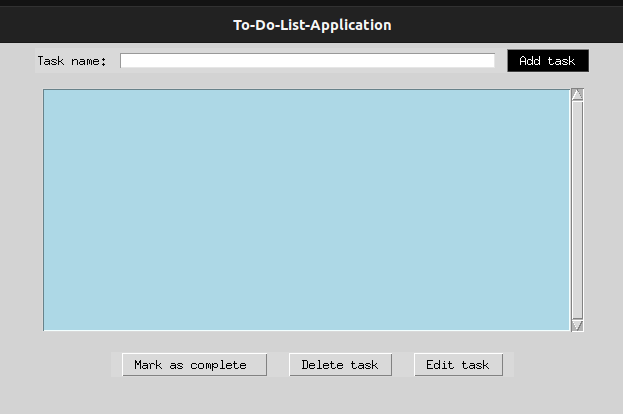

# To-Do List Application
---
A simple and intuitive to-do list application built using Python's Tkinter library. This application allows users to manage their daily tasks efficiently, offering features like task addition, editing, deletion, and marking tasks as complete. Tasks are saved locally, ensuring that your to-do list is available every time you open the application.

## Features

- **Add Tasks:** Easily add tasks to your to-do list.
- **Edit Tasks:** Update the name of any task in your list.
- **Delete Tasks:** Remove tasks that are no longer needed.
- **Mark as Complete:** Toggle the completion status of any task.
- **Persistent Storage:** Tasks are saved in a JSON file, so they persist between sessions.

## Screenshots



## Getting Started

Follow these instructions to get a copy of the project up and running on your local machine.

### Prerequisites

Make sure you have Python installed on your machine. You can download Python from [here](https://www.python.org/downloads/).

### Installation

1. **Clone the repository:**

   ```bash
   git clone https://github.com/Bbrnn/CODSOFT.git
   cd PythonInternshipProjects
   cd TO-DO-APP
   ```

2. **Run the application:**

   ```bash
   python3 Todo-list-app.py
   ```

3. **Install dependencies (if any):**

   If you don't have Tkinter installed, you can install it via:

   ```bash
   pip install tk
   ```

4. **Start the application:**

   Run the script using Python:

   ```bash
   python3 Todo-list-app.py
   ```

### How to Use

1. **Adding a Task:**
   - Type your task into the entry field.
   - Click on the "Add task" button to add it to your to-do list.

2. **Editing a Task:**
   - Select the task you want to edit from the list.
   - Type the new task name in the entry field.
   - Click on the "Edit task" button.

3. **Deleting a Task:**
   - Select the task you want to remove.
   - Click on the "Delete task" button.

4. **Marking a Task as Complete:**
   - Select the task you want to mark as complete.
   - Click on the "Mark as complete" button.


### Future Enhancements

- **Task Prioritization:** Allow users to set priority levels for tasks.
- **Search Functionality:** Implement a search bar to quickly find tasks.
- **Task Categories:** Organize tasks into different categories or projects.

### Contributing

If you'd like to contribute to this project, please fork the repository and use a feature branch. Pull requests are warmly welcome.


### Acknowledgments

- Thanks to the Python community for their excellent documentation and tutorials on Tkinter.
- Inspiration from various to-do list applications for ideas on functionality.

